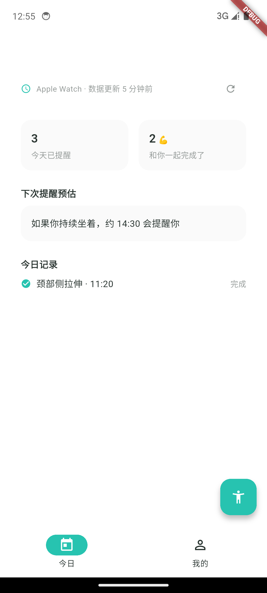

# Health Assistant · 健康助手

[](https://github.com/Colin994/health-assistant/actions/workflows/ci.yml)

一款面向「久坐干预」的健康管理 Flutter 应用：读取 Health Connect / Apple Health 的活动数据，在久坐间隙触发拉伸提醒，形成「数据 → 触发 → 反馈」的健康闭环。

> 状态：开发中（UI 与健康数据链路已落地，业务规则引擎开发中）

## ✨ 已实现

- **8 屏完整 UI**：首启引导 / 首页 / 拉伸 / 我的，双 Tab 架构，逐屏走查通过
- **自建设计系统**：设计 token（色/字/形/距）落地为 ThemeData，8 屏设计稿经版式审计
- **健康数据链路**：Health Connect（Android）/ HealthKit（iOS）读取近 24h 活动分段；授权与读写闭环已在模拟器验证
- **工程化**：Melos 16 包 monorepo，统一 lint 规则，一键 analyze / gen / test

## 📐 架构

三层五组件的 clean architecture + 单向数据流：

| 层 | 组件 | 落点 |
|---|---|---|
| 表现层 | Screen / ViewModel | `feature_*`（六件套：ScreenRoute/Screen/VM/State/Intent/Event） |
| 领域层 | UseCase | `domain_all` |
| 数据层 | Repository / DataSource | `core_health` 等 |

- **DI**：get_it + injectable microPackage 模式——库包自生成 Module，app 壳统一聚合注册
- **错误处理**：Result 模式（Success/Failure）；Repository 接口不暴露插件类型，保证数据源可替换
- **模块四分法**：`base_*`（基础设施）/ `feature_*`（功能）/ `domain_*`（用例）/ `core_*`（数据与模型）
- **规范**：架构总纲 + 命名规范（含反例速查表）双文档约束所有代码（见 `代码设计规范/`）

## 🖼 截图

| 引导 | 首页（走查） | 拉伸（走查） |
|---|---|---|
|  |  |  |

完整 8 屏设计稿与实现走查见 `design/ui_walk/`。

## 🛠 技术栈

Flutter / Dart ^3.12 · Melos 8 workspace · get_it + injectable 3 · health 13.x · drift（规划中）· flutter_lints 6

## 🚀 运行

```bash
melos bootstrap      # 初始化 16 包 workspace
melos run analyze    # 全模块静态分析
melos run gen        # build_runner 代码生成（DI 模块）
melos run test       # 全模块测试
cd app && flutter run
```

> Health Connect 需 Android 14+（或支持 HC 的设备）并安装 Health Connect；iOS 需在 Xcode 开启 HealthKit capability。

## 📚 文档体系

| 文档 | 版本 | 说明 |
|---|---|---|
| `docs/产品需求文档PRD.md` | v0.2 | 功能需求、北极星指标、路线 |
| `docs/交互设计文档.md` | v0.2 | 8 页线框、状态清单、文案规范 |
| `docs/技术设计文档.md` | v0.2 | 模块映射、UseCase 清单、里程碑 |
| `docs/设计规范.md` | v1 | 设计 token：色/字/形/距 |
| `代码设计规范/` | — | 架构总纲 + 命名规范（代码实现的强制约束） |

## 🗺 Roadmap

- 久坐规则引擎与提醒链路（core_reminder）
- drift 本地持久化（core_database）
- 用户档案与反馈事件（core_profile / core_model）
- snapshot / golden 测试体系（snapshot_test）

## 🤖 开发方式

架构设计、技术决策与验收由本人制定并把关，AI 辅助执行编码与设计稿生成。关键平台问题（如 Health Connect 授权链路、构建工具链）的排查与决策过程记录在提交历史与代码设计规范文档中。
