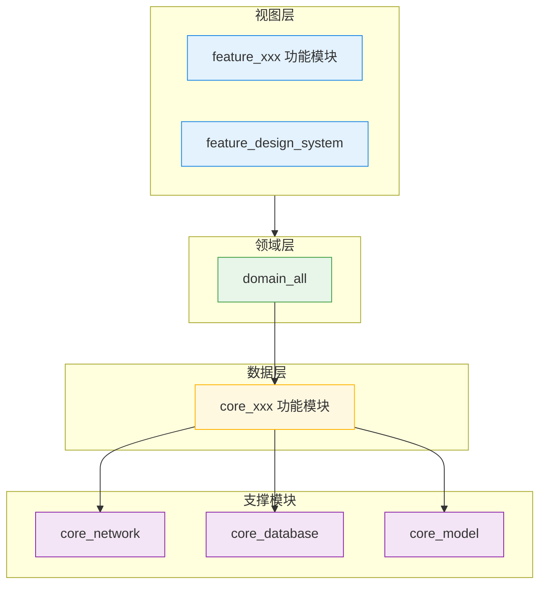

<!-- 本文件由 IMG_7270.md（视频 OCR 文本）整理而成：已对滚动重复内容去重、移除播放器 UI 噪声、
     修复系统性 OCR 识别错误、恢复标题层级与列表结构。
     其中「1. 模块依赖图」的文字版依赖图与 2.2.6 数据库模块正文为依上下文补写（文中已注明）；
     原文中 OCR 无法恢复的示例代码已删除。 -->

## 目录

- [一、前置说明](#一前置说明)
- [二、架构设计](#二架构设计)
  - [1. 模块依赖图](#1-模块依赖图)
  - [2. 分层设计和模块化设计](#2-分层设计和模块化设计)
    - [2.1 模块划分原则](#21-模块划分原则)
    - [2.2 模块说明](#22-模块说明)
      - [2.2.1 壳模块](#221-壳模块)
      - [2.2.2 视图层模块（功能模块）](#222-视图层模块功能模块)
      - [2.2.3 领域层模块](#223-领域层模块)
      - [2.2.4 数据层模块](#224-数据层模块)
      - [2.2.5 网络层模块](#225-网络层模块)
      - [2.2.6 数据库模块](#226-数据库模块)
      - [2.2.7 通用模块](#227-通用模块)
      - [2.2.8 快照测试模块](#228-快照测试模块)
  - [3. 编码说明](#3-编码说明)
    - [3.1 依赖注入](#31-依赖注入)
    - [3.2 视图层](#32-视图层)
    - [3.3 领域层](#33-领域层)
    - [3.4 数据层](#34-数据层)
    - [3.5 API 错误响应](#35-api-错误响应)
- [三、修订记录](#三修订记录)

## 一、前置说明

本文档用于对健康助手项目的架构设计进行留档和补充说明，是本项目多模块工程（Melos + pub workspace，16 个 package）的架构规范来源。

适用读者：健康助手项目的客户端开发人员。

关联文档：

- 《Flutter命名规范.md》：代码命名强制约束（同目录，已收录）。
- 《IM产品Flutter项目架构设计文档》：原架构总纲（本仓库未收录，待补充）。
- 《Flutter优化API错误响应：Result模式实践指南》：Result 模式的概念与实践，见 3.5（本仓库未收录，待补充）。

## 二、架构设计

### 1. 模块依赖图

> 注：原文此处为依赖图（图片）。下图系依本文档第 2 节的分层与模块描述整理的文字版依赖图，供参考，原图待补充。壳模块 app 与全局通用模块（base_utils、base_lints）未画出。

### 2. 分层设计和模块化设计

在分层上，项目拆分了三层：视图层、领域层、数据层，共包含 5 个架构组件：Screen、ViewModel、UseCase、Repository、DataSource。

- **视图层**
  - Screen：界面，纯 UI 实现，不包含业务代码。
  - ViewModel：界面的状态持有者，管理视图层的业务代码，负责视图层与数据层的数据交互。
- **领域层**
  - UseCase：用例，用于组织不同数据仓库之间的业务代码，负责抽取通用的数据层业务代码供视图层复用。
- **数据层**
  - Repository：数据仓库，用于组织数据源和数据仓库之间的业务代码，负责向上层暴露数据层的 API 接口。
  - DataSource：数据源，管理数据源的数据访问代码。

在模块划分上，项目主要区分了四类大的模块：base、feature、domain、core。

- base：存放项目层面的基础模块，如 base_utils 代表全局通用的工具模块。
- feature：存放视图层（功能）模块，按功能职责拆分。如 feature_login 代表登录模块的视图层、feature_design_system 代表视图层通用的 UI 模块等。
- domain：存放领域层模块，不拆分模块。如 domain_all 用于存放领域层（UseCase）相关的所有代码。
- core：存放数据层模块，按功能职责拆分。如 core_login 代表登录模块的数据层、core_chat 代表聊天模块的数据层等。

#### 2.1 模块划分原则

- 模块所具备的职责应该能在模块的命名体现出来。若模块职责偏通用则命名也应该偏通用，若模块职责偏具体则命名也应该偏具体。
- 若一个模块存放的代码量预计不大或模块间的代码不会耦合，则可以考虑创建较为通用的模块存放。若一个模块存放的代码量预计很大或模块内的代码职责很多容易耦合，则应该考虑拆分为具体的模块存放。
- 在三层架构设计上，视图层和数据层对应的模块要求拆分成具体的模块，而领域层模块只维护一个通用模块即可。
- 当对代码进行模块划分时，即使大的模块职责划分已经很清晰了，但因为模块间的各种业务关系，在细节上仍会遇到纠缠不清的情况，如一块业务代码放到 A 模块可以，放到 B 模块也可以，这种情况是符合预期的。在决定模块划分时，可以尝试讲一个符合逻辑、能自圆其说的故事，哪个故事讲得通，就可以将之作为模块拆分的依据。

#### 2.2 模块说明

模块的命名要求以存放的目录作为前缀，如 feature_、core_、base_。这是为了在目录结构排序上和模块的包名上，便于归类和理解。

##### 2.2.1 壳模块

项目中的 app 模块是整个模块化项目的壳模块。该模块是整个项目的入口，只负责组织各子模块的代码及进行相关初始化逻辑，不负责实现具体的功能。

##### 2.2.2 视图层模块（功能模块）

视图层模块用于存放 Screen 和 ViewModel 相关的代码。视图层模块要求按功能职责拆分，视图层的代码需要存放在具体职责的视图层模块中。若视图层代码偏通用（如通用 UI 组件、主题、国际化配置等），则存放在通用的视图层模块中，如 feature_design_system（见 2.2.7 通用模块）。

如：

- feature_login：登录模块的视图层，用于存放登录模块的视图层代码。
- feature_chat：聊天模块的视图层，用于存放聊天模块的视图层代码。

##### 2.2.3 领域层模块

项目中的 domain_all 模块用于存放领域层（UseCase）相关的所有代码。

领域层模块不需要根据功能职责拆分，因为领域层的代码彼此之间不会耦合，所以放在同一个模块中管理基本不会有耦合的风险。若后续有其它考虑，再考虑进行拆分。

##### 2.2.4 数据层模块

数据层模块用于存放 Repository 和 DataSource 相关的代码。数据层模块要求按功能职责拆分，数据层的 Repository 和 DataSource 代码需要存放在具体职责的数据层模块中。

如：

- core_login：登录模块的数据层，用于存放登录模块的数据层代码。
- core_chat：聊天模块的数据层，用于存放聊天模块的数据层代码。

##### 2.2.5 网络层模块

项目中的模块 core_network 是网络层模块，用于存放网络相关的代码，如短连接的封装、长连接的封装等，用于为数据层提供网络相关的支持。

##### 2.2.6 数据库模块

<!-- 本节正文原文缺失，以下内容按 2.2.5 的行文与模块命名规范补写，模块名与职责请以实际工程为准 -->

项目中的模块 core_database 是数据库模块，用于存放数据库相关的代码，如数据库的创建与升级、表结构的维护、数据读写的封装等，用于为数据层提供本地存储相关的支持。

##### 2.2.7 通用模块

- base_utils：全局的通用工具模块，不包含 UI 代码，存放可以全局使用的代码，如日志工具。
- feature_design_system：设计系统模块，存放视图层的通用代码，如通用的 UI 组件、应用的主题、应用的国际化配置等。design_system 这个概念对应着整个应用的 UI 设计风格，相关的代码用于统一整个应用的 UI 样式。
- core_model：全局通用的业务对象模块，只用于存放业务对象的类设计，不包含任何业务代码。该模块的主要目的是为了使下层模块可以使用业务对象进行数据转换。
- base_lints：静态代码检查模块，用于统一管理静态代码检查规则。

##### 2.2.8 快照测试模块

snapshot_test 模块仅用于进行快照测试。

快照测试需要专门建一个 snapshot_test 模块，是因为生成可视化的快照需要引入字体，而引入字体目前无法限制只在测试中使用。所以专门建一个模块去写快照测试，进而去避免将字体引入到实际的项目中。

### 3. 编码说明

#### 3.1 依赖注入

不同层级的架构组件均通过依赖注入的方式构造和获取，项目中引入了 get_it 和 injectable 提供依赖注入和相关的注解支持。具体用法请查看相关框架的使用文档。

如：使用 `@LazySingleton(as: LoginRepository)` 注解表示延迟初始化一个单例，对外暴露 LoginRepository 的抽象类，对应的实现类是 LoginRepositoryImpl。

如：使用 `@injectable` 注解表示通过工厂模式初始化一个对象，通过构造函数注入 LoginRepository 对应的实例。由于 LoginUseCase 使用的是 `@injectable` 注解，这表示获取到的 LoginUseCase 实例都是重新构造的。

如：使用 GetIt 从依赖注入容器中获取 LoginUseCase 的实例。由于 LoginUseCase 注入的是 LoginRepository，而 LoginRepository 对应的实现类 LoginRepositoryImpl 使用的是 `@LazySingleton` 注解，这表示 LoginUseCase 构造函数中注入的 LoginRepository 是 LoginRepositoryImpl，且 LoginRepositoryImpl 是一个延迟初始化的单例。

#### 3.2 视图层

视图层主要包含 Screen 和 ViewModel 的代码，如下所示：

- ScreenRoute：界面跳转的入口，Screen 和 ViewModel 之间通信的中间件，通过该中间件去避免 Screen 直接依赖 ViewModel。
- Screen：界面的 UI 代码，不直接依赖 ViewModel，通过 onIntent 函数将产生的 Intent 对外暴露。
- ViewModel：界面的状态持有者，用于持有视图数据，同时负责视图层与数据层之间的数据通信。
- State：Screen 对应的视图数据类。
- Intent：Screen 触发的事件，可以传递给 ViewModel 处理。
- Event：ViewModel 接收到的来自下层组件的事件，如服务器通知，可以作为一次性事件传递给 ScreenRoute 处理。

其中 Screen、ViewModel 属于第 2 节所述的核心架构组件；ScreenRoute、State、Intent、Event 是围绕二者组织代码的配套概念。

上述视图层的代码，均可以通过代码模板一键生成，这里不进行详细说明。

#### 3.3 领域层

领域层只包含 UseCase 的代码，UseCase 的目标是实现函数粒度的代码复用，相关规则如下所示：

- UseCase 只包含一个函数，且这个函数为 call 函数。这是为了 UseCase 可以像函数调用的形式去使用，即直接通过 () 去触发调用，而不用再写一遍函数名。
- UseCase 所需要的依赖，均定义在构造函数中，最终通过依赖注入形式获取到。
- UseCase 统一使用 `@injectable` 注解标记，这表示在依赖注入时使用工厂模式去构造 UseCase。
- 在数据仓库是单例的情况下，UseCase 虽然也可以定义为单例。但从使用场景来看，UseCase 并没有缓存数据的需求，它的目标仅是函数粒度的代码复用，定义为单例只是减少对象构造的次数并没有实际的意义。

#### 3.4 数据层

数据层由数据仓库和数据源共同构成，数据仓库和数据源均由对外暴露的接口和内部的具体实现组成，数据仓库对应的 Repository 和数据源对应的 DataSource 都是对外暴露的接口。

- 数据仓库对应的代码集：对应数据层的业务逻辑。
- 数据源对应的代码集：对应数据层的数据访问逻辑，负责与网络和数据库进行一系列的数据访问逻辑。

相关规则如下：

- 数据仓库只对外暴露接口 Repository，数据源只对外暴露接口 DataSource，采用面向接口设计的方式对外屏蔽内部实现。
- 数据仓库的 Repository 和数据源的 DataSource 均通过依赖注入的方式对外提供服务，同时默认情况下应该定义为单例。
- 不同职责的数据仓库和数据源应该将代码拆分到对应的模块去维护。

下面以 LoginRepository 为例进行说明：

- LoginRepository 是一个抽象类，用于对外暴露接口。
- LoginRepositoryImpl 是 LoginRepository 的实现类，除了需要实现对外暴露的接口外，还会有一系列内部的实现。
- LoginRepositoryImpl 通过使用 `@LazySingleton(as: LoginRepository)` 注解进行依赖注入的注册，该注解表示注入的 LoginRepository 的具体实例是 LoginRepositoryImpl，同时该实例是一个全局单例。

#### 3.5 API 错误响应

项目内封装了 Result 类用于提高 API 调用时错误响应的灵活性，在不同架构组件之间进行 API 调用时，若有错误响应的需求，可以使用 Result 类包装具体的返回值。

PS：Result 模式相关的概念具体可见《Flutter优化API错误响应：Result模式实践指南》。

如下所示：

- LoginUseCase 提供了一个返回值为 `Result<bool>` 的异步调用值。
- LoginUseCase 的调用处，可以拿到具体的 `Result<bool>` 返回值，并且可以使用 switch 进行类型匹配，进而去根据调用的返回类型去做合适的处理。
